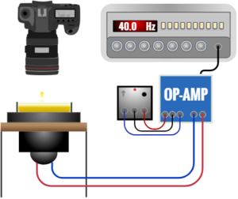

Title: Mutimodal RICM reconstruction
Date: 2020-01-17
Category: Biophysics
Tags: optics, adhesion
Slug: ricm_reconstruction
Author: Rémy Torro
Summary: Collection of notes related to the reonstruction of cell topography using the RICM microscopy technique. 

 

Introduction
============

#### 

[@walker_amateur_1978] first coined the term ‘walking droplet’ for a droplet bouncing around randomly in a vibrating fluid bath. In this magazine article, Walker describes James A. Raymond’s experiment in which he produced droplets of a water-detergent mixture bouncing on a vibrating bath for up to a few dozens of seconds. Silicon oil replaced the water-detergent mixture in later studies ([@protiere_particlewave_2006]) and the lifetime of the droplets was considerably extended. A study of ‘walking droplets’ in a circular corral revealed a statistical behavior similar to that of electrons in quantum corrals ([@harris_pilot-wave_2013]). The analogy with quantum mechanics was further explored in a hydrodynamic reconstruction of the double-slit experiment ([@pucci_walking_2018]), with contested results ([@klapp_recent_2016]). The topic of bouncing droplets revivified the pilot-wave theory of De [@broglie_mecanique_1927], in which quantum objects are localized and guided by a wave, not unlike the droplets. He quickly abandoned the theory because although it provided a deterministic description of quantum mechanics, it involved variables that cannot or have not been determined. Bouncing droplets seem to exhibit many behaviors similar to that of particles in the pilot-wave description ([@bush_pilot-wave_2015]). We reproduced Raymond’s experiment with linseed oil and characterized the bouncing droplets.

Theory
======

  

*Forces exerted on an oil droplet bouncing on a vibrating oil bath. $T$ is the time period of the droplet. $\vec{g}$ is the gravitational field. The associated force is $\vec{F_g}=m\vec{g}$, with $m$ the mass of the droplet. $\vec{F}$ is the force exerted by the compressed air layer on the droplet. This force is neglected when the droplet is far from the surface.*
#### 

Usually, when two volumes of the same fluid come into contact with each other (*e.g.* an oil droplet and a static oil bath), surface tensions try to minimize the interface between the two. The air trapped between the two volumes escapes softly and eventually the droplet coalesces with the oil bath. If the air separating the surfaces flows, a lubrication effect generates an upward lift on the droplet, maintaining the surfaces apart for a longer time. [@couder_bouncing_2005] showed that the drainage process of the air can be delayed by oscillating the bath vertically. Suppose that the vertical position of the oil bath follows: 

$$y_{s}(t)=A_{s}\cos{(2\pi f_{s} t)}$$ 

where $A_{s}$ and $f_{s}$ are respectively the amplitude and frequency of the oil bath. The acceleration can be defined as $\gamma_s=(2\pi f)^{2}A_s$. The Ohnesorge number associated with our experimental setup is smaller than one, so the deformations of the droplet cannot be neglected ([@gilet_dynamics_2008]).

$$\textrm{Oh} = \nu/\sqrt{\rho\sigma R} \\ \approx 0.0331 \times \sqrt{980\times 0.025 \times 0.001} \\ = 0.2 $$

with respectively $\nu$, $\rho$ and $\sigma$ the viscosity, density, surface tension of the fluid and $R$ the radius of the droplet. The droplet’s bouncing can be modelled by a differential equation describing the vertical displacement of the center of mass of the droplet $y$. In the frame of the vibrating bath, the droplet feels an apparent gravity $m(\gamma_s \cos(2\pi f_s t)-g)$ ($m$ is the mass of the droplet and $g=9.81$ m.s$^{-2}$ the gravitational field). The surrounding air exerts a force $F$ on the droplet. This force can be neglected except when there is a thin layer of air between the droplet and the bath surface. One can write Newton’s second law applied to the droplet as:

$$m\frac{d^2 y}{dt^2}=m(\gamma_s \cos(2\pi f_s t)-g)+F$$

Lubrication theory must be used to estimate $F$, which is a function of the thickness of the air layer $h$ and its rate of decrease $\dot{h}$. Eventually, the vertical displacement of a droplet in time $y(t)$ can be numerically computed.

Experimental setup
==================

   

*Experimental setup. A circular culture dish (diameter $0.10\pm0.002$ m, height $0.0112\pm0.002$ m) filled with linseed oil (surface tension $\sigma=0.025$ N.m$^{-1}$, density $\rho=980$ kg.m$^{-3}$ and volume $\tau=1.61\times 10^{-3}\pm 4\times10^{-4}$ m$^{3}$) is glued to a speaker powered by a low frequency generator in series with an amplifier. A camera is either mounted above the dish to get a top-view or slightly above one side of the dish to get a side-view.*

The basic components of the experimental setup are described above. We decided to use edible linseed oil, which is cheaper and easier to obtain than silicon oil ([@harris_visualization_2017]). The flatness of the surface of the oil bath at rest had to be carefully adjusted prior to acquiring data. We generated droplets by dipping and immediately pulling out a needle-shaped object in the linseed oil bath. A syringe of diameter $6.382\times 10^{-4}$ m allowed us to create droplets with $D \in [4.0\times 10^{-4} \textrm{m},9.0\times10^{-4} \textrm{m}]$, where $D$ is the diameter of the droplet. A $4.3\times 10^{-3}$ m lollipop tube enabled us to produce droplets with $D \in [9.0\times 10^{-4} \textrm{m},2.5\times10^{-3} \textrm{m}]$. We did not control the diameter of a droplet. On the other hand, we could set the frequency $f_g$ and amplitude $A_g$ of the function generator.
This signal was translated by the speaker into a sinusoidal oscillation, of frequency $f_s$ and acceleration $\gamma_s$ directly applied to the liquid bath. In general $f_g \approx f_s$ whereas $A_g$ was not directly related to $\gamma_s/(2\pi f_s)^2$, because of our use of an amplifier.

#### 

The camera could film at up to 500 frames per second. In the top-view setup, we aligned the camera vertically above the liquid bath and filmed at 50 frames per second. This way, we could easily follow the trajectory of a droplet on the surface of the liquid bath but we lost information about its vertical acceleration and frequency. In the side-view setup we could recover this information by filming at 400 frames per second. We used a 50 cm focal length lens in order to have a good focus on the bouncing droplets. We recorded short videos of various droplets, for different $(f_g,A_g)$ parameters, using the diameter of the needle as a
spatial calibration. We post-treated the videos using the software *Tracker*. For a given video of a droplet, we could generally extract
simultaneously $D$, $\gamma_s$, $f_s$, $\gamma_d$, $f_d$ where $\gamma_d$ and $f_d$ are respectively the vertical acceleration and frequency of a bouncing droplet.

Results
=======

 

*Acceleration of the liquid bath $\gamma_s$ for which the surface becomes unstable at a given frequency $f_s$, a measurement of the so-called Faraday threshold. In our experiment $(f_s,\gamma_s)$ were chosen such that the surface of the linseed oil remained stable, below the Faraday threshold. A linear regression was performed, yielding the approximate equation $\gamma_s = 0.4 \times f_s + 8.19$, seemingly valid for $f_s \in [25.0 \textrm{Hz}, 60.0 \textrm{Hz}]$.*

The above figure shows the almost linear dependency between the frequency $f_s$ and the acceleration $\gamma_s$ of the fluid bath at the Faraday threshold. To get this result, we used the side-view setup. We set $f_g$ at a chosen value and increased $\gamma_g$ until the
twisted Faraday patterns appeared. We recorded this transition at 400 frames per second and measured from the videos $f_s$ and $\gamma_s$ at the regime transition (shown in the two pictures above and under the linear regression curve). All of our subsequent results were obtained in the stable regime, under the curve.

*$\Gamma − \Omega$ plane for a set of 95 droplets randomly generated. The regime of a droplet is determined qualitatively. Droplets not moving horizontally (fixed) are easily identified. It is slightly more difficult to discriminate between a ‘walker’ and a ‘drifter’; the drifter has a quasi-uniform motion in a single direction, unlike the walker, whose motion is quasi-random. The region in this plane for which walkers can be found is $(\Gamma, \Omega) = (1 − 2.4, 0.45 − 2.2)$.*

The above figure was made by analyzing 95 droplets and extracting
from the associated videos their radius $R_0=D/2$, $\gamma_s$ and $f_s$. Two dimensionless parameters could be constructed from the many variables of our experiment; firstly a vibration number: 

$$\Omega = \frac{\omega}{\omega_D}=2\pi f_s\sqrt{\frac{\rho R_0^3}{\sigma}}$$ 

where $\omega=2\pi f_s$ is the bath angular frequency and $\omega_D=\sqrt{\sigma/(\rho R_0^3)}$ is a characteristic drop oscillation frequency. And secondly a peak non-dimensional bath acceleration: 

$$\Gamma = \frac{\gamma_s}{g}$$ 

where $g=9.81$ m.s$^{-2}$ is the gravitational acceleration.

This couple of parameters $(\Gamma,\Omega)$ was computed for each of the droplets and plotted on a $\Gamma - \Omega$ plane. Each droplet was qualitatively labelled as either a ‘walker’, a ‘drifter’ or a fixed droplet. Intermediary behaviors exist but are very hard to identify with unaided eyes.

#### 

    

*Common bouncing regimes of the droplets. The vertical oscillation of the droplets is directly compared to that of the fluid bath at the same time t. The first droplet (a) had the following characteristics: $(\Gamma, \Omega) = (1.80 \pm 0.4, 1.99 \pm 0.3)$. This is the typical mode $(1,1)$ for a ‘drifter’. The second droplet (b) is representative of a ‘walker’ with $(\Gamma, \Omega) = (1.471 \pm 0.4, 1.098 \pm 0.2)$ and a $(4, 3)$ mode. The last droplet (c) is also a ‘walker’ but its chaotic behavior makes it unstable and unpredictable. This regime can be obtained very near the Faraday threshold.*

A closer look at the oscillating behavior of individual droplets is necessary to understand why they may behave differently from each other. Similar modes of vibration are usually found between droplets belonging to the same region of the $\Gamma - \Omega$ plane. A mode can be characterized as a couple of values $(n,m)$ where $n$ is the number of times a droplet bounces while the liquid bath oscillates $m$ times. The main modes are presented in the figure above. In these figures, the oscillation of the fluid bath is a curve fit of the experimental data performed using the `SciPy` python library.

Discussion
==========

#### 

The almost linear relation between the acceleration and the frequency of the fluid bath at the Faraday threshold was obtained in prior
experiments ([@slaughter_viscosity_2014]). The characterization of the droplets in the regime diagram may have been overly simplistic. It
would have been more rigorous to determine the bouncing mode of each droplet, but this is extremely time-consuming. Our conclusion that
‘walkers’ are concentrated in one region of the $\Gamma-\Omega$ plane is in agreement with literature ([@molacek_drops_2013]). We never managed to extend the lifetime of ‘walking droplets’ beyond a few dozen seconds. This is mostly due to our poor frequency generator fluctuating slightly in time. The fastest ‘walkers’ are obtained very near the Faraday threshold. This threshold is very unstable and any fluctuation of the frequency may disrupt the flatness of the fluid bath. On the other hand, we managed to keep almost static (in the plane) droplets bouncing for several minutes.

#### 

    

Droplets always interact with each other in some fashion. When two ‘walkers’ pass each other, different behaviors have been observed. If
the radii of the droplets are very different, a common outcome is the absorption of the smaller droplet by the bigger one. At high velocities and similar droplet radii, they may orbit each other, until one of them coalesces with the fluid bath. Often, droplets tend to remain at a stable small distance from each other. This property could be used to create crystal-like structures of droplets.

Introducing a new droplet in such a complex usually resulted in a quick and chaotic reorganization of the crystal. All of these observations were qualitative and would need more time to be properly studied.

#### 

Most of the data was obtained by tracking droplets. It means that we were limited by the resolution of our camera. Some droplets were only a few pixels large and their tracking might have been approximate. In addition, the droplets were never perfectly spherical. Although we could obtain precise frequency measurements (an uncertainty $\Delta f_{s,d} =0.3$ Hz), by averaging a large number of $y(t)$ periods, the accelerations were very sensitive to the slightest tracking errors. Fortunately, our computations only involved $\gamma_s$, the acceleration of the fluid bath which was easier to track than most droplets and eventually led to a smaller error ($\Delta \gamma_s=3$ m.s$^{-2}$, which may seem a lot but is more of a bias than an error).

Conclusion
==========

#### 

As a conclusion, this experiment enabled us to investigate the strange behavior of ‘walking droplets’. From bouncing modes to interactions
between droplets, the observations were diverse and should provide a first, basic introduction to the hot topic of bouncing droplets. Many observations were not presented in this report due to a lack of time, and are left aside for future investigations. Furthermore, material issues prevented us from generating stable ‘walkers’ and consequently from observing their statistical behavior. The double-slit experiment was quickly dismissed for the same reason. A macroscopic object whose motion is dictated by a ‘guiding’ wave is a fascinating object and other analogies with quantum phenomena will certainly be found in the near future.

Acknowledgements
================

We are thankful to researcher N. Papageorgiou who provided us with this topic idea, and was our pilot-wave. We are also grateful to the rest of the teaching staff who assisted us and provided the required gear and equipment.

