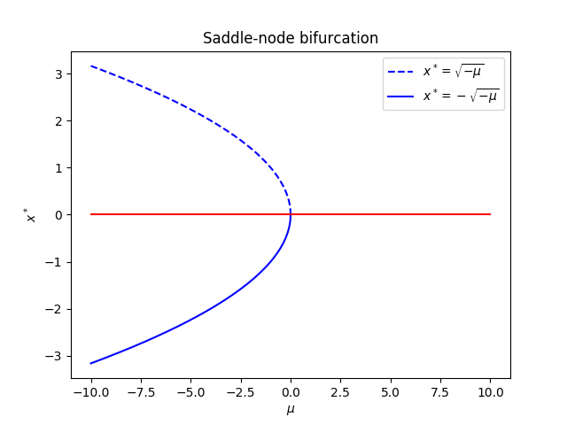

Title: Bifurcations
Date: 2019-12-10 10:20
Category: Physics
Tags: Dynamical systems
Slug: bifurcations
Author: Rémy Torro
Summary: Basics of bifurcation theory.

 

# Saddle-node bifurcation

Consider the following dynamics:

$$ \dot{x} = f_\mu(x) = \mu + x^2$$

At the fixed points, we have $\dot{x}=0$, so:

$$ 0 = \mu + (x^*)^2$$

So $x^*_\pm = \pm \sqrt{-\mu}$, for $\mu < 0$. We can study the stability of each fixed point: $\frac{\partial f}{\partial x} = 2 x^*$. For $x^* = \sqrt{-\mu} > 0$, the solution is unstable, whereas for $x^* = -\sqrt{-\mu}$, the solution is stable. For $\mu = 0$, both solutions annihilate each other. 

