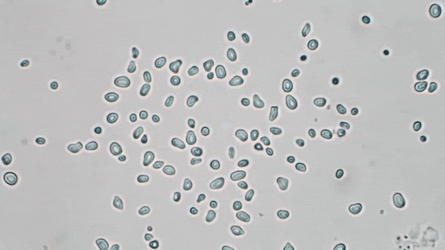
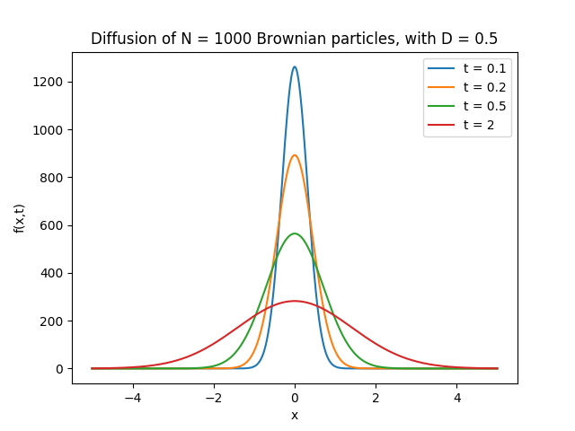
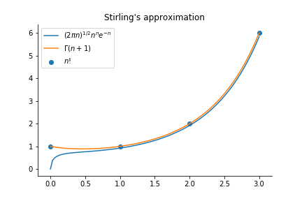

Title: Brownian motion 
Date: 2019-12-10 10:20
Category: Physics
Tags: Diffusion, Stochastic
Slug: brownian-motion
Author: Rémy Torro
Summary: Einstein's and Langevin's respective derivations of the Brownian motion.

> In 1827, botanist Robert Brown observed the jittery motion of pollen grains (*Clarkia pulchella*) suspended in water. He proved that this motion was not life-related but could not explain its origin. 

# Einstein's derivation

Eighty years later, Albert Einstein published a paper ([@einstein_motion_nodate]) in which he inferred the motion of the pollen grains to collisions with individual water molecules. He had to make the following hypotheses:

* The motion of each individual particle is independent of the motion of all the other particles. They solely interact with the fluid. 
* Suppose that we can define $\tau$ such that the motions of a same particle in different time intervals $\tau$ are independent processes. 
* $\tau$ is large enough so that a particle is struck in every direction many times between $t$ and $t+\tau$. But $\tau$ is very small compared to macroscopic time scales.

Suppose that a total of $N$ suspended particles is present in the liquid. In the time interval $\tau$ the spatial coordinate of the individual particles will increase by $\Delta$, with a certain probability distribution law $\Phi(\Delta)$. The number $d N$ of particles experiencing a displacement that lies between $\Delta$ and $\Delta + d\Delta$ in the time interval $\tau$ can be expressed as: 
$$ dN = N \Phi(\Delta) d\Delta $$
$\Phi$ is a probability characterized by:
$$ \int_{-\infty}^\infty \Phi(\Delta) d\Delta = 1 \qquad \textrm{(normalization condition)}$$
$$ \int_{-\infty}^\infty \Delta \Phi(\Delta) d\Delta = 0 \qquad \textrm{(isotropy of space)}$$

Let $f(x,t)$ be the number of particles per unit volume. The distribution of particles at time $t+\tau$ from their distribution at $t$ can be written as:

$$ f(x,t+\tau) = \int_{-\infty}^\infty f(x-\Delta, t) \Phi(\Delta) d\Delta $$

On one hand, we can expand to first order in powers of $\tau$; $f(x,t+\tau) = f(x,t) + \tau \frac{\partial f}{\partial t}(x,t) + \mathcal{o}(\tau^2)$ and to second order in powers of $\Delta$; $f(x-\Delta,t)=f(x,t)-\Delta \frac{\partial f}{\partial x}(x,t)+\frac{\Delta^2}{2}\frac{\partial^2 f}{\partial x^2}(x,t)+\mathcal{o}(\Delta^3)$. Subtituting in the above equation yields:

$$\begin{align}f(x,t)+\tau \frac{\partial f}{\partial t}(x,t) = \int_{-\infty}^\infty  \left[f(x,t)-\Delta \frac{\partial f}{\partial x}(x,t)+\frac{\Delta^2}{2}\frac{\partial^2 f}{\partial x^2}(x,t) \right] \Phi(\Delta) d\Delta \\ =f(x,t) \underbrace{\int_{-\infty}^\infty \Phi(\Delta) d\Delta}_{= 1}-\frac{\partial f}{\partial x}(x,t) \underbrace{\int_{-\infty}^\infty \Delta \Phi(\Delta) d\Delta}_{= 0} + \int_{-\infty}^\infty \frac{\Delta^2}{2}\frac{\partial^2 f}{\partial x^2}(x,t) \Phi(\Delta) d\Delta\end{align}$$
$$ \frac{\partial f}{\partial t}(x,t) = \frac{\partial^2 f}{\partial x^2}(x,t) \int_{-\infty}^\infty \frac{\Delta^2}{2\tau} \Phi(\Delta) d\Delta $$

$$ \frac{\partial f}{\partial t}(x,t) = D  \frac{\partial^2 f}{\partial x^2}(x,t) $$

where $D = 1/(2\tau) \int_{-\infty}^\infty \Delta^2 \Phi(\Delta) d\Delta$ is the diffusion coefficient. 

Since the motions of all the individual particles are independent, we can introduce a coordinate system whose origin coincides with the position of the center of gravity of the particle in question at time $t=0$, with the difference that $f(x,t)dx$ denotes the number of particles whose spatial coordinate has increased between the times $t=0$ and $t=t$ by a quantity that lies somewhere between $x$ and $x+dx$. We must have:

$$f(x,t) = 0 $$
$$ \int_{-\infty}^\infty f(x,t) dx = N $$

The solution to the problem is:

$$ f(x,t) = \frac{N}{\sqrt{4\pi D t}}e^{-\frac{x^2}{4 D t}} $$

The probability distribution of the resulting displacements during an arbitrary time $t$ is the same as the distribution of random errors. 

The mean quadratic displacement is $\sigma^2 = \langle x^2 \rangle = 2 D t$. As a result, the mean displacement is proportional to the square root of time. 

# Langevin's derivation

Langevin introduced a stochastic differential equation ([@langevin]):

$$ m \frac{d^2 x}{dt^2} = -\lambda \frac{dx}{dt} + \xi(t) $$

in which $-\lambda \dot{x}$ is some viscous resistance due to the motion of the particle in the water (Stokes law, $\lambda = 6 \pi \mu a$) and $\xi(t)$ some fluctuating force exerted by the water molecules on the Brownian particle. 

We can multiply on the right and left by $x$:

$$ m x\frac{d^2 x}{dt^2} = -\lambda x \frac{dx}{dt} + x \xi(t) $$

On one hand: $\frac{d^2(x^2)}{dt^2} = \frac{d}{dt}\left[\frac{d (x^2)}{dt}\right] = \frac{d}{dt}\left[2 x \frac{dx}{dt} \right] = 2 \left(\frac{dx}{dt}\right)^2 + 2 x \frac{d^2 x}{dt^2}$. On the other hand: $x\frac{dx}{dt} = \frac{1}{2}\frac{d(x^2)}{dt}$. Substituting in the above equation, we obtain:

$$ \frac{m}{2} \frac{d^2(x^2)}{dt^2} - m \left(\frac{dx}{dt}\right)^2 = - \frac{\lambda}{2} \frac{d(x^2)}{dt}+x\xi(t)$$

We can take the average over a large number of particles and get:

$$ \frac{m}{2} \frac{d^2 \langle x^2 \rangle}{dt^2} + \frac{\lambda}{2} \frac{d\langle x^2 \rangle}{dt} = m \langle v^2 \rangle$$

assuming that $\langle x \xi(t) \rangle = 0$ (because $\xi(t)$ can be equally positive or negative). Let's also assume that $m\langle v^2 \rangle = \frac{R T}{N_A} = k_B T$ (equipartition theorem). This second order differential equation can be solved as:

$$ \frac{d \langle x^2 \rangle}{dt} = C e^{-\frac{\lambda t}{m}}  + \frac{2 k_B T}{\lambda}$$  

Since $m/\lambda \approx 10^{-8} s$, we can neglect the exponential term and end up with:

$$ \langle x^2 \rangle = 2 \frac{k_B T}{\lambda} t  = 2 D t$$

with $D = \frac{k_B T}{\lambda} = \frac{R T}{N_A}\frac{1}{6 \pi \mu a}$.

#From a microscopic random walk to diffusion

The microscopic irregular movements of particles may result in some macroscopic motion for the group (particle density, concentration) that we may think of as a *diffusion process*. We will start with a microscopic random process and eventually derive a deterministic model. Let's consider the one-dimensional random walk process. 

A particle moves randomly back and forward along a line in fixed steps $\Delta x$ that are taken in a fixed time $\Delta t$. For an unbiased motion, it is equally probable for the particle to move to the left or to the right. After time $N\Delta t$, the particle must be somewhere between $-N\Delta x$ and $N\Delta x$, if we take the starting point to be $x=0$. 

We want the probability $p(m,n)$ that a particle reaches a point $m$ space steps to the right ($x=m\Delta x$) after $n$ time steps (after a time $n\Delta t$). Let's call $a$ the number of steps to the right and $b$ the number of steps to the left. 

$$ m = a-b, \qquad a+b = n \qquad \rightarrow \ a = \frac{n+m}{2}, \qquad b = n - a$$

The number of possible paths allowing the particle to reach the point $x=m\Delta x$ is 

$$ \frac{n!}{a!b!} = \frac{n!}{a!(n-a)!} = C^n_a$$

The total number of possible $n$-step paths is $2^n$ and so the probability $p(m,n)$ is:

$$ p(m,n) = \frac{n!}{a!(n-a)!}\frac{1}{2^n}$$ 

If we let $n$ to be very large so that $n \pm m$ is also very large, we have asymptotically, 

$$ n! \sim (2\pi n)^{1/2}n^n e^{-n}, \qquad n\rightarrow \infty$$

which is Stirling's formula. We can apply this to the expression for $p(m,n)$ and derive the Gaussian probability distribution for the particle:

$$ p(m,n) \sim \left[\frac{2}{\pi n}\right]^{1/2}\exp \left[\frac{-m^2}{2n} \right]$$

Remark: $m$ and $n$ need not be very large for the approximation to be accurate. We can take $m\Delta x = x$ and $n \Delta t = t$. Since $\Delta x$ and $\Delta t$ must go to zero in the continuum limit, $m$ and $n$ will go to infinity in order to keep $x$ and $t$ finite. In this limit, the probability $p(m,n)$ diverges so instead one must consider $u = p/(2\Delta x)$

$$ \frac{p(\frac{x}{\Delta x},\frac{t}{\Delta t})}{2 \Delta x} \sim \left(\frac{\Delta t}{2\pi t(\Delta x)^2} \right)^{1/2} \exp \left[-\frac{x^2}{2t}\frac{\Delta t}{(\Delta x)^2} \right]$$

Assuming 

$$ \lim_{\Delta x \rightarrow 0 \\ \Delta t \rightarrow 0} \frac{(\Delta x)^2}{2\Delta t} \rightarrow D$$

We have

$$u(x,t) =  \lim_{\Delta x \rightarrow 0 \\ \Delta t \rightarrow 0} \frac{p(\frac{x}{\Delta x},\frac{t}{\Delta t})}{2 \Delta x} = \frac{1}{\sqrt{4\pi D t}} \exp \left[-\frac{x^2}{4 D t} \right]$$

where $D$ is the diffusion coefficient of the particles: it has dimension (length)$^2/$(time). It measures how efficiently the particles disperse from high to a low density. 
