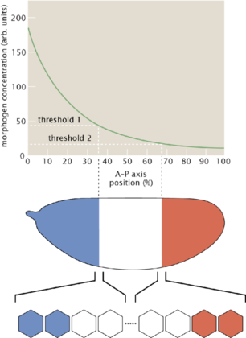

Title: Information content in biological systems
Date: 2019-12-10 10:20
Category: Physics
Tags: Information, Biophysics
Slug: information
Author: Rémy Torro
Status: draft
Summary: Basics of information theory applied to biophysical problems. 

 

We will be interested in a simple model of *Drosophila* embryo development, the French-flag model. Each cell performs concentration measurements and infer their position from this, which will affect their differentiation. 

The entropy $H$ of a discrete random variable $X$ with the probability distribution function $p(x) = p(X = x)$ can be defined as:

# Information theory

$$ H(X) = H[p(x)] = - \int_S p(x)\log_2 p(x) dx = -\langle \log_2 p(x) \rangle$$

$S$ is the domain on which $p$ is defined. The entropy is the average number of bits required to describe the outcome of $X$. What probability distribution maximizes $H(x)$ for a prescribed $\mu = \langle x \rangle_x$ and variance $\sigma^2 = \langle (x-\mu)^2 \rangle_x$? 

We will use a variational approach. Let's introduce $\overline{H} = H(x) + \sum_{i=0}^M \lambda_i \int_S p(x) x^i dx$ ($M = 0,1,2$, respectively the normalization condition, constrained mean and constrained variance). We must solve $\delta \overline{H} = 0$:

$$ \delta \overline{H} = \int_S dx \left[ -\log_2 e (\ln{p(x) + 1}) + \sum_{i=0}^M \lambda_i x^i \right] \delta p(x) = 0$$

The solution is:

$$ p(x) = \exp\left[-1 + \frac{1}{\log_2 e} \sum_{i=0}^M \lambda_i x^i \right]$$

| $M$    | $S$           | $p(x)$                                                           |  $H(X)$                                    |
| :---:  | :---:         |     :---:                                                        | :---:                                      | 
|  0     | $[x_0,x_1]$   | $\frac{1}{x_1 - x_0}$                                            | $\log_2 (x_1 - x_0)$                       |
|  1     | $[0,\infty[$  | $\frac{1}{\mu}e^{-x/\mu}$                                        | $\log_2 e(1+\ln \mu)$                      |
|  2     | $\mathbb{R}$  | $\frac{1}{\sqrt{2\pi\sigma^2}} e^{-\frac{(x-\mu)^2}{2\sigma^2}}$ | $\frac{1}{2} \log_2 (2\pi e \sigma^2)$     |

How do we know that this expression for $p(x)$ maximizes (instead of minimizing) the entropy? We will need Jensen's inequality. Say that we have a concave function $f$ such that $f^{''}(x) \leq 0$ everywhere. Let's consider a function $g$ such that:

$$ \langle g(x) \rangle_x = \int_S dx p(x) g(x)$$

Jensen's inequality states that if $X$ is a random variable and $f$ a convex function, then $f(\langle X \rangle) \leq \langle f(X) \rangle$. Assuming a function $g(x)$ as our random variable, we can write: 

$$ f(\langle g(x) \rangle_x) \geq \langle f(g(x)) \rangle_x $$

Here we use $f = \log_2$ and a probability distribution function $q(x)$:

$$ \log_2 \int_S dx q(x) g(x) \geq \int_S dx Q(x) \log_2 g(x)$$

Let's say that $q$ has the same average $\mu = \langle x \rangle_{q(x)}$ and variance $\sigma^2 = \langle (x-\mu)^2 \rangle_{q(x)}$:

$$ H[q(x)] = -\int dx \log_2 \left[q(x) \frac{p(x)}{p(x)} \right]q(x) = \underbrace{\int_S dx q(x) \log_2 \frac{p(x)}{q(x)}}_{\leq \log_2 \int_S dx q(x) \frac{p(x)}{q(x)}} - \int_S dx q(x) \log_2 p(x)$$

We can apply Jensen with $g = p/q$:

$$ \int_S dx q(x) \log_2 p(x) = \int_S dx q(x) \left[-1 + \frac{1}{\log_2 e} \sum_{i=0}^M \lambda^i x^i \right] = -1 + \frac{1}{\log_2 e}[\lambda_0 + \lambda_1 \mu + \lambda_2 (\sigma^2 + \mu^2)] = \int_S dx p(x) \left[-1 + \frac{1}{\log_2 e} \sum_{i = 0}^M \lambda_i x^i = \int_S dx p(x) \log_2 p(x) \right]$$

$$ H[q(x)] \leq H[p(x)]$$

**Joint entropy** of two random variables: consider two random variables $X$ and $Y$ which are not necessarily independent, with joint probability distribution function $p(x,y)$:

$$ H(x,y) = - \int_{S_x} dx \int_{S_y} dy p(x,y) \log_2 p(x,y) = - \langle \log_2 p(x,y) \rangle_{x,y}$$

Notice: in general, $H(x,y) \neq H(x) + H(y)$

The conditional entropy of $Y$ given $X$ is defined by:

$$ H(Y|X) = - \int_{S_x} dx p(x) \int_{S_y} dy p(y|x) \log_2 p(y|x) = - \langle \log_2 p(y|x) \rangle_{x,y} $$

This is the average number of bits required to describe the outcome $Y$ given that the other person (the reciever) already knows the outcome of $X$. 

$$ H(X,Y) = H(X) + H(Y|X) $$

**Proof**:

$$ H(X) + H(Y|X) = -\int_{S_x} dx \int_{S_y} p(x,y) \log_2 p(x) - \int_{S_x} dx \int_{S_y} dy p(x,y) \log_2 p(y|x) = H(X,Y)$$

The mutual information between $X$ and $Y$ is defined by:

$$ I(X,Y) = \int_{S_x} dx \int_{S_y} dy p(x,y) \log_2 \frac{p(x,y)}{p(x)p(y)}$$ 

$$ I(X,Y) = \langle \log_2 \frac{p(x,y)}{p(x) p(y)} \rangle_{x,y} = H(X) + H(Y) - H(X,Y)$$

$$ I(X,Y) = H(Y) - H(Y|X) = H(X) - H(X|Y)$$

This holds because of the chain rule.

# From concentrations to positions

This is the correct measure for our biological problem: from measuring my set of protein concentrations $\{g_i\}$, how much information can a cell gain about its own position ($I(\{g_i\},X)$)? This could be quantified by approximating $P(\{g_i\},X)$ using statistics over many embryos. For $N \geq 2$, this would require too many embryos. 

**Gaussian approximation**: 

$$ I(\{g_i\},X) = H(\{g_i\}) - H(\{g_i\}|X)$$

Gaussian approximation for a single gene:

$$ p(g|x) = \frac{1}{\sqrt{2\pi\sigma^2_g}} e^{-\frac{(g-\overline{g})^2}{2\sigma_g^2}} $$

where $\overline{g}(x) = \langle g(x) \rangle$ and $\sigma_g^2 = \langle (g(x) - \overline{g}(x))^2 \rangle$.

$$ p(\{g_i\}|x) = (2\pi)^{-N/2} |C(x)|^{-1/2} \exp\left[\frac{1}{2}\sum_{i,j = 1}^N (g_i - \overline{g}_i (x))[C^{-1}(x)]_{i,j} (g_j - \overline{g_j}(x)) \right]$$

where $\overline{g}_i(x)$ is defined as above and $C_{ij} (x) = \langle g_i(x) g_j(x) - \overline{g}_i(x) \overline{g}_j(x) \rangle$, and $|C(x)|$ is its determinant and $C^{-1}$ its inverse. From this, one obtains:

$$ H(\{g_i\},X) = \frac{N}{2} \log_2(2\pi e) + \frac{1}{2} \langle \log_2 |C(x)| \rangle_x$$
