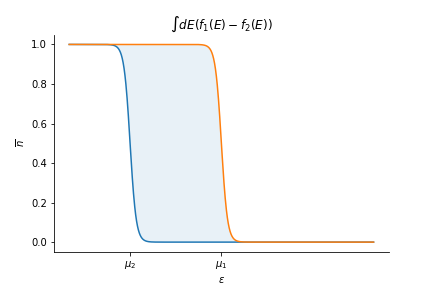

Title: Landauer transport
Date: 2019-12-10 10:20
Category: Physics
Tags: Condensed matter, Quantum physics
Slug: landauer-transport
Author: Rémy Torro
Summary: Landauer-Büttiker formalism for electronic transport in multiterminal devices. 
 

Transport phenomena in a mesoscopic conducting system can be described with a quantum mechanical scattering problem approach ([@moskalets_scattering_2011]). Consider a mesoscopic sample connected to $N_r$ macroscopic reservoirs of electrons (the leads). If we apply some voltage or if the leads are characterized by different chemical potentials $\mu_r$, there will be a flow of electrons. Electrons coming from the different leads enter the sample, are scattered inside of it before leaving and returning to either the source reservoir (reflected) or another reservoir (transmitted). All the information about the transport properties of the sample will be encoded in the scattering matrix $S$, such that:

$$\psi^{(\textrm{out})} = S \psi^{(\textrm{in})}$$
$$ $$
where $\psi^{(\textrm{out})}$ and $\psi^{(\textrm{in})}$ are respectively scattered and incoming waves. The elements of matrix $S$ are transmission amplitudes. By definition:

$$ S S^\dagger = S^\dagger S = \mathbb{I}$$

The current flowing between the sample and the reservoirs can be computed without knowing what happens to each electron inside the sample. It is sufficient to study the flow of electrons across the interfaces between the sample and the reservoirs. 

# 1) Current in lead $m$
The current operator is defined as: 

$$ I_m(x_m) = \frac{\hbar e}{2 m i} \left(\psi_m^\dagger \frac{\partial \psi_m}{\partial x_m} - \frac{\partial \psi_m^\dagger}{\partial x_m}\psi_m \right)$$

where $\psi_m$ is a wave function at "position" $m$ in the system (composed of some transmitted and reflected part on the sample):

$$ \psi_m = \sum_n \int \frac{dk}{\sqrt{2\pi}} \left(\delta_{mn}e^{i k x_m}+ S_{mn}e^{-i k x_m} \right)c_n(k) $$

where $S_{mn}$ are elements of the scattering matrix. Their modulus square gives some transmission and reflection probabilities. The derivative with respect to $x_m$ of $\psi_m$ can be expressed as:

$$ \frac{\partial \psi_m}{\partial x_m} = \sum_n \int \frac{dk}{\sqrt{2\pi}}(i k) \left(\delta_{mn}e^{i k x_m}- S_{mn}e^{-i k x_m} \right)c_n(k) $$

We can now plug these two expressions back into the expression for $I_m(x_m)$:

$$\begin{align}I_m(x_m) = \frac{\hbar e}{2 m i} \left\{  \sum_n \int \frac{dk}{\sqrt{2\pi}} \left(\delta_{mn}e^{-i k x_m}+ S_{mn}^* e^{i k x_m} \right)c_n^\dagger(k) \sum_{n'} \int \frac{dk'}{\sqrt{2\pi}}(i k') \left(\delta_{mn'}e^{i k' x_m}- S_{mn'}e^{-i k' x_m} \right)c_{n'}(k')
- \sum_n \int \frac{dk}{\sqrt{2\pi}}(- i k) \left(\delta_{mn}e^{-i k x_m}- S_{mn}^*e^{i k x_m} \right)c_n^\dagger(k)
\sum_{n'} \int \frac{dk'}{\sqrt{2\pi}} \left(\delta_{mn'}e^{i k' x_m}+ S_{mn'}e^{-i k' x_m} \right)c_{n'}(k') \right\} \\ = \frac{\hbar e}{2 m}\sum_{n,n'}\int \frac{dk dk'}{2 \pi}\left[ (\delta_{mn}e^{-i k x_m}+ S_{mn}^* e^{i k x_m})(k' \delta_{mn'}e^{ik'x_m}-k' S_{mn'}e^{-ik'x_m})- (-k\delta_{mn}e^{-i k x_m}+ k S_{mn}^* e^{i k x_m})(\delta_{mn'}e^{i k' x_m}+S_{mn'}e^{-ik' x_m}) \right]c_n^\dagger(k)c_{n'}(k')\end{align}$$

We can rearange the products in the square brackets $[...]$:

$$ [...] = k' \delta_{mn'}\delta_{mn}e^{i(k'-k)x_m}-\delta_{mn}k' S_{mn'}e^{-i(k+k')x_m}+S_{mn}^* k' \delta_{mn'}e^{i(k+k')x_m}-k'S_{mn'}S_{mn}^* e^{-i(k'-k)x_m} + k \delta_{mn}\delta_{mn'}e^{-i(k-k')x_m}+k\delta_{mn}S_{mn'}e^{-i(k+k')x_m}-k S_{mn}^* \delta_{mn'}e^{i(k+k')x_m}-kS_{mn}^* S_{mn'}e^{i(k-k')x_m} = (k'+k)(\delta_{mn}\delta_{mn'}e^{-i(k-k')x_m} - S_{mn'}S_{mn}^* e^{i(k-k')x_m}) + (k'-k)(S_{mn}^* \delta_{mn'}e^{i(k+k')x_m}-\delta_{mn}S_{mn'}e^{-i(k+k')x_m})$$ 

As a result we can write:

$$ I_m(x_m) = \int \sum_{n,n'} \frac{dk dk'}{2\pi}\left[ \frac{\hbar e}{2 m}(k'+k) \left(\delta_{mn}\delta_{mn'}e^{-i(k-k')x_m} - S_{mn'}S_{mn}^* e^{i(k-k')x_m}\right) \\ +  \frac{\hbar e}{2 m} (k'-k)\left(S_{mn}^* \delta_{mn'}e^{i(k+k')x_m}-\delta_{mn}S_{mn'}e^{-i(k+k')x_m}\right) \right]c_n^\dagger(k)c_{n'}(k')$$

Assuming $E(k) = \frac{\hbar^2 k^2}{2 m}$, we have $dE = \frac{\hbar^2 k}{m} dk$, and as a result: $dk = \frac{m}{\hbar^2 k}dE$. We can substitute $dk dk' = \frac{m^2}{\hbar^4 k k'} dE dE'$:

$$I_m(x_m) = \int \sum_{n,n'} dE dE' \left[ \underbrace{\frac{e m}{4\pi \hbar^3}(k'^{-1}+k^{-1}) \left(\delta_{mn}\delta_{mn'}e^{-i(k-k')x_m} - S_{mn'}S_{mn}^* e^{i(k-k')x_m}\right)}_{M_m^{\Delta k}(E,E',n,n')}
\\+ \underbrace{\frac{e m}{4\pi \hbar^3} (k^{-1}-k'^{-1})\left(S_{mn}^* \delta_{mn'}e^{i(k+k')x_m}-\delta_{mn}S_{mn'}e^{-i(k+k')x_m}\right)}_{M_m^{\sum k}(E,E',n,n')} \right]c_n^\dagger(E)c_{n'}(E') 
\\ = \int dE \int dE' \sum_{n,n'} \underbrace{\left[ M_m^{\Delta k}(E,E',n,n')+M_m^{\sum k}(E,E',n,n')\right]}_{M_m(E,E',n,n')} c_n^\dagger(E)c_{n'}(E')$$

# 2) Average current
At thermal equilibrium, the quantum statistical average of the product of a fermionic creation and annihilation operator is:

$$ \langle c_n^\dagger(k) c_{n'}(k') \rangle \sim \delta_{n,n'}\delta(k-k') \quad \textrm{(using a bracket representation for the average)}$$ 

$$ \langle c_n^\dagger c_n \rangle_{GC} = Z^{-1} \textrm{Tr} \ e^{-\sum_{p}\beta(E_{p}-\mu)c_{p}^\dagger c_{p}}c_n^\dagger c_n$$

where $GC$ means that the average is taken in the grand-canonical ensemble. On one hand $Z = \textrm{Tr } e^{-\beta \sum_p (E_p - \mu) c_p^\dagger c_p}$. So we can recognize that:

$$ \langle c_n^\dagger c_n \rangle_{GC} = -\frac{1}{\beta}\frac{\partial \ln Z}{\partial (E_n - \mu)}$$

On the other hand, for fermions, the only occupation numbers $c_n^\dagger c_n$ are $0$ or $1$ (Pauli's exclusion principle). So we can rewrite $Z$ as:

$$ Z = \prod_{p} \left( 1 + e^{-\beta(E_{p} - \mu)}\right)$$

As a result:

$$ \langle c_n^\dagger c_n \rangle_{GC} = -\frac{1}{\beta} \frac{\partial}{\partial (E_n - \mu)} \sum_{p} \ln \left(1+e^{-\beta(E_{p}-\mu)}\right) = \frac{e^{-\beta(E_n - \mu)}}{1+e^{-\beta(E_n - \mu)}} = \frac{1}{e^{\beta(E_n - \mu)}+1} = f_n(E_n)$$

where $f_n(E_n)$ is a Fermi-Dirac distribution in reservoir $n$. Eventually we have the following expression for $\langle c_n^\dagger (E) c_{n'}(E') \rangle$:

$$ \langle I_m(x_m) \rangle \propto \langle c_n^\dagger (E) c_{n'}(E') \rangle = \frac{\hbar^2 k(E)}{m} f_n(E) \delta(E-E') \delta_{nn'}$$

If we set $E = E'$, it implies that $k^2 = k'^2$ (since $k$ and $k'$ are positive, we have $k = k'$). Plugging $k=k'$ in the expression for $M_m^{\sum k}$ gives zero because of the $(k^{-1} - k'^{-1})$ term. We have:

$$ M_m^{\Delta k} (E=E',n,n') = \frac{e m}{2 \pi \hbar^3} k^{-1} (\delta_{mn}\delta_{mn'} - S_{mn}^* S_{mn'})$$

We can write the expression for the average current as:

$$\langle I_m(x_m) \rangle = \int dE \sum_n \frac{e}{2 \pi \hbar} (\delta_{mn}\delta_{mn'} - S_{mn}^* S_{mn'})f_n(E)\delta_{nn'} = \int dE \frac{e}{2 \pi \hbar} \left[\sum_n \delta_{mn}f_n(E) - \sum_n |S_{mn}|^2 f_n(E)\right] 
= \frac{e}{h} \int dE \left[f_m(E) - \sum_n |S_{mn}|^2 f_n(E)\right]$$

But since $\sum_n |S_{nm}|^2 = 1$, we can factorise:

$$ \langle I_m \rangle =  \frac{e}{h} \int dE \sum_n |S_{mn}|^2 (f_m(E)-f_n(E))$$

We find that the average current does not depend on the position $x_m$ at which the current is measured. 

# 3) Landauer conductance for a 2-lead device

$$\langle I \rangle = \frac{1}{2}(\langle I_1 \rangle - \langle I_2 \rangle) = \frac{e}{2h} \int dE \left[\sum_n |S_{1n}|^2 (f_1(E) - f_n(E))-\sum_p |S_{2p}|^2 (f_2(E) - f_p(E)) \right] = \frac{e}{2h} \int dE \left[|S_{12}|^2(f_1(E)-f_2(E))-|S_{21}|^2 (f_2(E)-f_1(E))\right] = \frac{e}{h} |S_{12}|^2 \underbrace{\int dE (f_1(E) - f_2(E))}_{eV} = \frac{e^2}{h} |S_{12}|^2 V$$

where we have assumed that $|S_{12}|^2$ and $|S_{21}|^2$ do not depend on the energy $E$. Let's call $T$ the transmission probability. $T = |S_{12}|^2 = |S_{21}|^2$ so:

$$ \langle I_{\textrm{2-lead}} \rangle = \underbrace{\frac{e^2}{h} T}_{\textrm{Landauer conductance}} V$$

If we consider electron's spin-degeneracy $g_i = 2$ that could be introduced in the Fermi-Dirac distributions, we can write:

$$ \langle I_{\textrm{2-lead}} \rangle = \underbrace{\frac{2 e^2}{h} T}_{\textrm{Landauer conductance }(g_i=2)} V$$

In the following, the spin degeneracy factor will be neglected, in order to simplify computations, as in Büttiker's derivation ([@blanter_shot_2000]). 

# 4) Cross-correlation

The noise at zero-frequency can be expressed as:

$$ \mathcal{S}_{mn} = \lim_{T \rightarrow \infty} \frac{2}{T}\int_{-T/2}^{T/2} dt \int_{-\infty}^\infty dt' \langle (I_m(t) - \langle I_m \rangle)(I_n(t+t')-\langle I_n \rangle) \rangle$$

We have to compute $\textrm{Cov}[I_m,I_n] = \langle (I_m(t) - \langle I_m \rangle)(I_n(t+t')-\langle I_n \rangle) \rangle = \langle I_m(t)I_n(t+t') \rangle - \langle I_m \rangle \langle I_n \rangle$. Firstly let's evaluate $\langle I_m(t)I_n(t'') \rangle$, where $t'' = t+ t'$. 

$$\langle I_m(t)I_n(t'') \rangle \propto \langle c_{p_1}^\dagger (k(E_1),t) c_{p_2} (k(E_2),t) c_{p_3}^\dagger (k(E_3),t'') c_{p_4} (k(E_4),t'') \rangle = \langle c_{p_1}^\dagger (k(E_1)) c_{p_2} (k(E_2)) c_{p_3}^\dagger (k(E_3)) c_{p_4} (k(E_4)) \rangle e^{\frac{i}{\hbar}(E_1 - E_2)t} e^{\frac{i}{\hbar}(E_3 - E_4)t''}$$

We can apply Wick's theorem to the averaged term and obtain:

$$\underbrace{\langle c_{p_1}^\dagger (k(E_1)) c_{p_2}(k(E_2)) \rangle \langle c_{p_3}^\dagger (k(E_3)) c_{p_4}(k(E_4)) \rangle}_{\propto \langle I_m \rangle \langle I_n \rangle \qquad \textrm{(reducible contrib.)}} + \underbrace{\langle c_{p_1}^\dagger (k(E_1)) c_{p_4} (k(E_4)) \rangle \langle c_{p_2} (k(E_2)) c_{p_3}^\dagger (k(E_3)) \rangle}_{\textrm{(irreducible contrib.)}} = \frac{\hbar^4}{m^2} k(E_1) f_{p_1}(E_1)\delta(E_1 - E_2)\delta_{p_1 p_2} k(E_3) f_{p_3}(E_3) \delta(E_3 - E_4) \delta_{p_3 p_4} + \frac{\hbar^4}{m^2} k(E_1) f_{p_1}(E_1) \delta{E_1 - E_4} \delta_{p_1 p_4} k(E_2) (1 \mp f_{p_2}(E_2))\delta(E_2 - E_3) \delta_{p_2 p_3}$$

If we apply $E_1 = E_2$ and $E_3 = E_4$ to the time exponential we get zero for the first term of the sum, whereas with $E_1 = E_4$ and $E_2 = E_3$ we obtain $e^{\frac{i}{\hbar}(E_1 - E_2)(t - t'')}$. Eventually we can write:

$$\langle I_m(t) I_n(t'') \rangle \propto \frac{\hbar^4}{m^2} \left[\underbrace{k(E_1) k(E_3) f_{p_1}(E_1) f_{p_3}(E_3) \delta_{p_1 p_2} \delta_{p_3 p_4} \delta(E_1 - E_2)\delta(E_3 - E_4)}_{\propto \langle I_m \rangle \langle I_n \rangle} + k(E_1) k(E_2) f_{p_1}(E_1) (1 \mp f_{p_2}(E_2)) \delta_{p_1 p_4} \delta_{p_2 p_3} \delta(E_1 - E_4) \delta(E_2 - E_3) e^{\frac{i}{\hbar} (E_1 - E_2)(t - t'')} \right] $$

# 5) Noise

The reducible term is cancelled with $\langle I_m \rangle \langle I_n \rangle$ in $\textrm{Cov}[I_m,I_n]$. As a result, the covariance is proportional to the irreducible term (let's call it $\tilde{C}(E_1,E_2,p_1,p_2,p_3,p_4)$) in the 4-fermions correlator. In other words, we are left with the irreducible contribution under the integral sign ($S_{mn}$), up to some factors. The covariance can be written as:

$$\textrm{Cov}(I_m,I_n) = \int \prod_{i=1}^4 dE_i \sum_{p_1,p_2,p_3,p_4} M_m(E_1,E_2,p_1,p_2)M_n(E_3,E_4,p_3,p_4) \tilde{C}(E_1,E_2,p_1,p_2,p_3,p_4)$$

$\tilde{C}$ contains $\delta(E_1 - E_4)$, $\delta(E_2 - E_3)$, $\delta_{p_1 p_4}$, $\delta_{p_2 p_3}$. So we can set $E_1 = E_4$, $E_2 = E_3$, $p_1 = p_4$ and $p_2 = p_3$:

$$ \textrm{Cov}(I_m,I_n) = \int dE_1 \int dE_2 \sum_{p_1,p_2} M_m(E_1,E_2,p_1,p_2) M_n(E_2,E_1,p_2,p_1) \tilde{C}(E_1,E_2,p_1,p_2) $$

Let's set $E_1 = E$, $E_2 = E'$, $p_1 = p$ and $p_2 = p'$:

$$\textrm{Cov}(I_m,I_n) = \int dE \int dE' \sum_{p,p'} M_m(E,E',p,p') M_n(E',E,p',p) \tilde{C}(E,E',p,p') 
= \frac{\hbar^4}{m^2} \int dE \int dE' \sum_{p,p'} M_m(E,E',p,p') M_n(E',E,p',p) k(E) k(E') f_p(E) (1 \mp f_{p'}(E')) e^{\frac{i}{\hbar}(E-E')(t-t'')}$$

Substituting in the expression for $S_{mn}$ above, we have to integrate over $t'$ the exponential $\int dt' e^{\frac{i}{\hbar}(E-E')(t-t'')} = \int dt' e^{-\frac{i}{\hbar}(E-E')t'} = 2 \pi \hbar \delta(E-E')$. Applying the condition that $E = E'$ in the expression for the covariance of the current, we observe that the $M_i$ terms are greatly simplified. The $M_i^{\sum k} = 0$, once again, due to the $k^{-1} - k'^{-1}$ terms. We are left with the product: 
$$M_m^{\Delta k}(E=E',p,p') M_n^{\Delta k}(E'=E,p',p)
= \frac{e^2 m^2}{4 \pi^2 \hbar^6} \frac{1}{k^2} \left(\delta_{mp} \delta_{mp'} - S_{mp}^* S_{mp'} \right)\left(\delta_{np'}\delta_{np} - S_{n p'}^* S_{n p} \right)$$

Eventually we can substitute and write the following expression for the zero-frequency noise:

$$ \mathcal{S}_{mn} = \lim_{T \rightarrow \infty} \frac{2 e^2}{T h}\int_{-T/2}^{T/2} dt \int dE \sum_{p,p'} f_p(E)(1 \mp f_{p'}(E))\left(\delta_{mp} \delta_{mp'} - S_{mp}^* S_{mp'} \right)\left(\delta_{np'}\delta_{np} - S_{n p'}^* S_{n p} \right)$$

Since nothing depends on time under the integral sign, we have $\int_{-T/2}^{T/2} dt = T$ and as a result:

$$ \mathcal{S}_{mn} = \frac{2 e^2}{h} \int dE \sum_{p,p'} f_p(E)(1 \mp f_{p'}(E))\left(\delta_{mp} \delta_{mp'} - S_{mp}^* S_{mp'} \right)\left(\delta_{np'}\delta_{np} - S_{n p'}^* S_{n p} \right)$$

# 6) 2-terminal device

For a two-terminal device, the scattering matrix can be expressed as:

$$S = \begin{pmatrix} 
r & t' \\
t & r'
\end{pmatrix}$$

where $r^{(i)}$ and $t^{(i)}$ are reflection and transmission amplitudes. 

Let's compute $\mathcal{S}_{11}$ for a two-terminal device:

$$ \mathcal{S}_{11} = \frac{2 e^2}{h} \int dE \sum_{p,p'} f_p(E)(1 \mp f_{p'}(E))\left(\delta_{1p} \delta_{1p'} - S_{1p}^* S_{1p'} \right)\left(\delta_{1p'}\delta_{1p} - S_{1p'}^* S_{1p} \right) $$

Let's develop the integrand:

$$\begin{align} \sum_{p,p'} f_p(E)(1 \mp f_{p'}(E))\left(\delta_{1p} \delta_{1p'} - S_{1p}^* S_{1p'} \right)\left(\delta_{1p'}\delta_{1p} - S_{1p'}^* S_{1p} \right) \\ = \left(f_1(1 \mp f_1) - |S_{11}|^2 f_1(1 \mp f_1) - |S_{11}|^2 f_1(1 \mp f_1) + \sum_{p,p'} |S_{1p}|^2 |S_{1p'}|^2 f_p(1\mp f_{p'}) \right) = \left(f_1(1 \mp f_1)(1 - 2|S_{11}|^2) + |S_{11}|^4 f_1(1 \mp f_1) + |S_{11}|^2|S_{12}|^2 f_1(1 \mp f_2) + |S_{12}|^2 |S_{11}|^2 f_2(1 \mp f_1) + |S_{12}|^4 f_2(1 \mp f_2) \right) \\ = f_1(1 \mp f_1)\left(1 - 2 |S_{11}|^2 \right) + |S_{11}|^2 |S_{12}|^2 \left(f_1(1 \mp f_2) + f_2(1 \mp f_1)\right) + |S_{11}|^4 f_1(1 \mp f_1) + |S_{12}|^4 f_2(1 \mp f_2)
\end{align}$$

We want to express everything as a function of $|S_{12}|^2 = T$, the transmission probability. We can use the unitary property of the matrix $S = (S_{ij}) \in \mathbb{R}^{2 \times 2}$: $S S^\dagger = \mathbb{I}$ and $S^\dagger S = \mathbb{I}$. From the condition $|S_{11}|^2 + |S_{12}|^2 = 1$, we have $|S_{12}|^2 = 1 - |S_{11}|^2$, so $|S_{12}|^4 = 1 - 2|S_{11}|^2 + |S_{11}|^4$, and we can substitute.   

$$\begin{align} \mathcal{S}_{11} = \frac{2 e^2}{h} \int dE \left\{ |S_{12}|^4 [f_1(1 \mp f_1)+f_2(1 \mp f_2)] + |S_{12}|^2 (1 - |S_{12}|^2)[f_1(1 \mp f_2) + f_2 (1 \mp f_1)] \right\} \\
= \frac{2 e^2}{h} \int dE \left\{ T^2 [f_1(1 \mp f_1)+f_2(1 \mp f_2)] + T (1 - T)[f_1(1 \mp f_2) + f_2 (1 \mp f_1)] \right\} \end{align}$$

We can now compute the noise at thermal equilibrium ($k_B T >> |\mu_1 - \mu_2|=eV$). Since the temperature is much larger than $eV$ we can safely set $\mu_1 \approx \mu_2$ which implies that $f_1 \approx f_2 = f$. Substituting in the expression for $\mathcal{S}_{11}$, we get:

$$\mathcal{S}_{11,\textrm{th}} = \frac{2 e^2}{h} \int dE (2 f \mp 2 f^2)(T^2 + T(1-T)) = \frac{4 e^2}{h} \int dE T(f \mp f^2) = \frac{4 e^2}{h} \int dE Tf(1 - f) $$

where in the last line we have selected the upper sign $-$ for fermions. But $f(1-f) = -k_B \Theta \frac{\partial f}{\partial E}$. So we have:

$$\mathcal{S}_{11,\textrm{th}} = \frac{4 e^2}{h} T (-k_B \Theta) \int dE \frac{\partial f}{\partial E} = -\frac{4 e^2}{h} T k_B \Theta f(E)|^{\infty}_0 = -\frac{4 e^2}{h} T k_B \Theta f(E)|^{\infty}_0 = \frac{4 e^2}{h} T k_B \Theta = 4 k_B \Theta \underbrace{\frac{e^2}{h} T}_{\textrm{Landauer conductance}} = 4 k_B \Theta G$$

At low temperatures $k_B \Theta << |\mu_1 - \mu_2|$, the fermi functions tend to perfect step functions such that $f \rightarrow f^2$ and $f(1 - f) \rightarrow 0$ (see the graph below). If we substitute in our equation for the noise $\mathcal{S}_{11}$, we get:

$$\mathcal{S}_{11,\textrm{gr}} = \frac{2 e^2}{h} \int dE \left\{ T^2 [0 + 0] + T(1-T)[f_1 + f_2 - 2 f_1 f_2] \right\} = \frac{2 e^2}{h} \int dE T(1-T)[f_1^2 + f_2^2 - 2 f_1 f_2] = \frac{2 e^2}{h} T(1-T) \underbrace{\int dE (f_1 - f_2)^2}_{e V} = 2 e \left(\frac{e^2}{h}T V\right)(1-T) = 2 e \langle I \rangle(1-T)$$

# 7) 3-lead device

We are now interested in the 3-lead device at very low temperature ($k_B \Theta = 0$). The scattering matrix is now a $3 \times 3$ matrix. We want to prove that when $\mu_2 = \mu_3$, $\mathcal{S}_{23} < 0$. Since we only have two different chemical potentials, we can use once again the expression for the noise that we derived at the end of question 5. We can write:

$$ \mathcal{S}_{23} = \frac{2 e^2}{h} \int dE \sum_{p,p'} f_p(E)(1-f_{p'}(E))(\delta_{2p}\delta_{2p'}-S^*_{2p}S_{2p'})(\delta_{3p'}\delta_{3p}-S_{3p'}^* S_{3p}) = \frac{2 e^2}{h} \int dE \sum_{p,p'} f_p(E)(1-f_{p'}(E)) [\underbrace{\delta_{2p}\delta_{2p'}\delta_{3p'}\delta_{3p}}_{0}-\delta_{2p}\delta_{2p'}S_{3p'}^*S_{3p}-S^*_{2p}S_{2p'}\delta_{3p'}\delta_{3p}+S^*_{2p}S_{2p'}S_{3p'}^*S_{3p}] = \frac{2 e^2}{h} \int dE [-\underbrace{f_2(1-f_2)S_{32}^*S_{32}}_{\rightarrow 0}-\underbrace{f_3(1-f_3)S_{23}^*S_{23}}_{\rightarrow 0}+\sum_{p,p'} f_p(1-f_{p'})S_{2p}^* S_{2p'}S_{3p'}^* S_{3p}]$$

$p$ and $p'$ must take values $1,2,3$. The terms $f(1-f)$ go to zero as before, because we are at $\theta = 0$ K. We can expand the sum as:

$$ \sum_{p,p'} f_p(1-f_{p'})S_{2p}^* S_{2p'}S_{3p'}^* S_{3p} =  \underbrace{f_1(1-f_1)|S_{21}|^2|S_{31}|^2}_{\rightarrow 0} + f_1(1-f_2)S_{21}^* S_{22} S_{32}^* S_{31} + f_1(1-f_3)S_{21}^* S_{23} S_{33}^* S_{31} + f_2(1-f_1)S_{22}^* S_{21} S_{31}^* S_{32}+\underbrace{f_2(1-f_2)|S_{22}|^2 |S_{32}|^2}_{\rightarrow 0} + \underbrace{f_2(1-f_3)S_{22}^* S_{23}S_{33}^* S_{32}}_{\rightarrow 0}+f_3(1-f_1)S_{23}^* S_{21} S_{31}^* S_{33} + \underbrace{f_3(1-f_2)S_{23}^* S_{22}S_{32}^* S_{33}}_{\rightarrow 0} + \underbrace{f_3(1-f_3)|S_{23}|^2 |S_{33}|^2}_{\rightarrow 0} = f_1(1-f_2)S_{21}^* S_{22}S_{32}^* S_{31} + f_1(1-f_2)S_{21}^* S_{23}S_{33}^*S_{31}+f_2(1-f_1)S_{22}^* S_{21} S_{31}^* S_{32}+f_2(1-f_1)S_{23}^* S_{21} S_{31}^* S_{33} 
= f_1 S_{21}^* S_{31}\underbrace{[S_{22}S_{32}^* + S_{23}S_{33}^*]}_{-S_{21}S_{31}^*}+f_2 S_{21}S_{31}^* \underbrace{[S_{22}^*S_{32}+S_{23}S_{33}]}_{-S_{21}^* S_{31}}-f_1 f_2 [S_{21}^*S_{31}\underbrace{(S_{22}S_{32}^*+S_{23}S_{33}^*)}_{-S_{21}S_{31}^*}+S_{21}S_{31}^*\underbrace{(S_{22}^*S_{32}+S_{23}^*S_{33})}_{-S_{21}^*S_{31}}] = -f_1|S_{21}|^2|S_{31}|^2 - f_2|S_{21}|^2|S_{31}|^2 + 2 f_1 f_2 |S_{21}|^2 |S_{31}|^2 = -|S_{21}|^2|S_{31}|^2(f_1 - f_2)^2 $$

where we used $f_2 = f_3$ (from $\mu_1 = \mu_2$), $f_{0 \textrm{K}}\approx f^2_{0 \textrm{K}}$ and equations derived from the unitary property of the scattering matrix: $S S^\dagger = \mathbb{I}$, namely:

$$S_{21}S_{31}^* + S_{22}S_{32}^* + S_{23}S_{33}^* = 0 $$
$$S_{31}S_{21}^* + S_{32}S_{22}^* + S_{33}S_{23}^* = 0 $$ 

Eventually we can write:

$$\mathcal{S}_{23} = -\frac{2 e^2}{h}|S_{21}|^2|S_{31}|^2 \underbrace{\int dE (f_1 - f_2)^2}_{|\mu_1 - \mu_2|} = - C^{st} |S_{21}|^2|S_{31}|^2 |\mu_1 - \mu_2| $$

The current fluctuations between lead 2 and 3 are anticorrelated ([@martin_wave-packet_1992]), *i.e.* one increases when the other decreases.  
