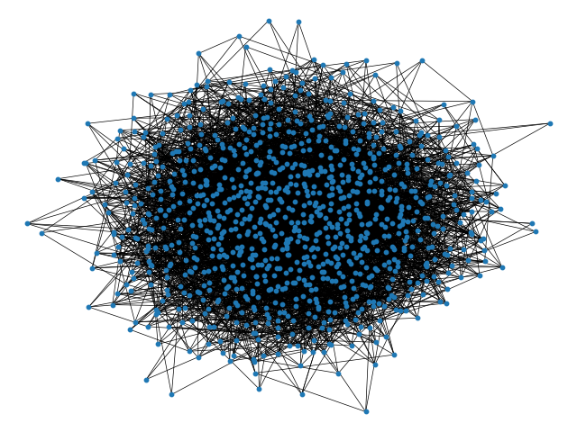
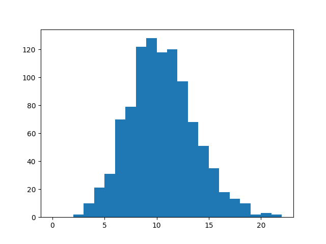
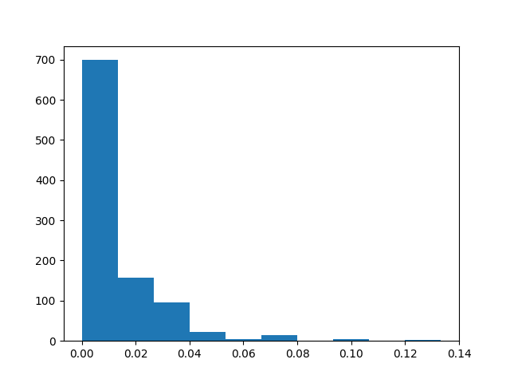
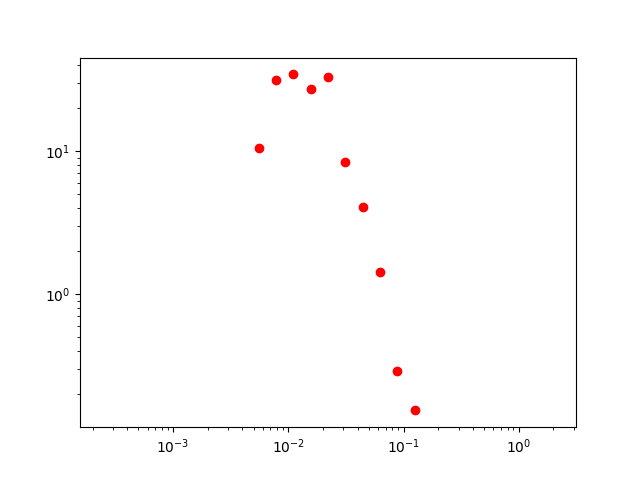

Title: Complex networks
Date: 2019-12-10 10:20
Category: Physics
Tags: Complex networks
Slug: complex-network
Author: Rémy Torro
Summary: An investigation of complex system networks using the python package <code>networkx</code>.

 

# Erds-Rényi model

The Erds-Rényi (or random) model might be the simplest way to create a graph. You must set the number of nodes $N$ and a probability $p$ to put a link between any pair of nodes. The total number of pairs of nodes is $\frac{N(N-1)}{2}$ and the average number of links is naturally:

$$ \langle L \rangle = p \frac{N(N-1)}{2}$$

The average degree $k$ of a node is $\langle k \rangle = p(N-1)$ (there are $N-1$ neighbors for which the probability to have a link is always $p$).   

	:::python
	N = 1000
	p = 0.01
	E = N*(N-1)/2 #number of possible links
	nE = int(p*E) #actual number of links in the network

	G = nx.Graph()
	lNodes = range(N)

	for i in range(nE):
		a,b = sample(lNodes,2) #sample() takes randomly two nodes in lNodes
		while G.has_edge(a,b):
			a,b = sample(lNodes,2)
		G.add_edge(a,b)

	nx.draw_spring(G,node_size=10,width=0.5)

This program randomly chooses two nodes and creates a link if none existed before. Otherwise it moves on to another pair of nodes. It does this process $\langle L \rangle$ times.

	::python
	lK = list(dict(G.degree()).values())
	plt.hist(lK,bins=range(0,max(lK)+2))

	::python
	dC = nx.clustering(G)
	lC = list(dC.values())
	h = plt.hist(lC,bins=10)

The `nx.clustering()` function computes the clustering coefficient for a node $n$, i.e. the fraction of possible triangles through that node that exists:

$$ c_n = \frac{2 T(n)}{k(n)(k(n)-1}$$

where $T(n)$ is the number of triangle through node $n$ and $k(n)$ is the degree of $n$. 

	::python
	x = 2.**np.arange(-12,2,0.5)
	h = np.histogram(lC,bins=x,density=True)
	plt.loglog(x[:-1],h[0],r"$\rho$")

# Barabási-Albert

To be completed

