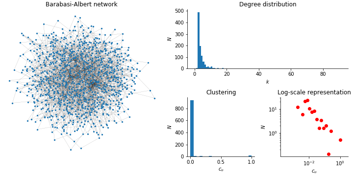

Title: Complex networks
Date: 2019-12-10 10:20
Category: Physics
Tags: Complex networks
Slug: complex-network
Author: Rémy Torro
Status: draft
Summary: An investigation of complex system networks using the python package <code>networkx</code>.

 

# Erds-Rényi model

> The Erds-Rényi (or random) model might be the simplest way to create a graph. 

You must set the number of nodes $N$ and a probability $p$ to put a link between any pair of nodes. The total number of pairs of nodes is $\frac{N(N-1)}{2}$ and the average number of links is naturally:

$$ \langle L \rangle = p \frac{N(N-1)}{2}$$

The average degree $k$ of a node is $\langle k \rangle = p(N-1)$ (there are $N-1$ neighbors for which the probability to have a link is always $p$).   

	:::python
	N = 1000
	p = 0.01
	E = N*(N-1)/2 #number of possible links
	nE = int(p*E) #actual number of links in the network

	G = nx.Graph()
	lNodes = range(N)

	for i in range(nE):
		a,b = sample(lNodes,2) #sample() takes randomly two nodes in lNodes
		while G.has_edge(a,b):
			a,b = sample(lNodes,2)
		G.add_edge(a,b)

	nx.draw_spring(G,node_size=10,width=0.5)

This program randomly chooses two nodes and creates a link if none existed before. Otherwise it moves on to another pair of nodes. It does this process $\langle L \rangle$ times.

	::python
	lK = list(dict(G.degree()).values())
	plt.hist(lK,bins=range(0,max(lK)+2))

	dC = nx.clustering(G)
	lC = list(dC.values())
	h = plt.hist(lC,bins=10)

The `nx.clustering()` function computes the clustering coefficient for a node $n$, i.e. the fraction of possible triangles through that node that exists:

$$ c_n = \frac{2 T(n)}{k(n)(k(n)-1}$$

where $T(n)$ is the number of triangle through node $n$ and $k(n)$ is the degree of $n$. 

	::python
	x = 2.**np.arange(-12,2,0.5)
	h = np.histogram(lC,bins=x,density=True)
	plt.loglog(x[:-1],h[0],r"$\rho$")

# Barabási-Albert

> The Barabási-Albert model allows to generate scale-free ($P(k) \sim k^{-\gamma}$) networks, according to some preferential attachment mechanism. Good examples include the world wide web, citation networks and social networks, containing some nodes with a very high degree $k$, compared to the other nodes in the network,called hubs.

One must start with an initial connected network of $m_0$ nodes. New nodes are added to the network one at a time. Each new node is connected to $m \leq m_0$ existing nodes with a probability proportional to the number of links that the existing nodes have. The probability $p(n \rightarrow i)$ that the new node $n$ is connected to node $i$ is:

$$ p(n \rightarrow i) = \frac{k_i(t-1)}{\sum_j k_j(t-1)}$$

Thus, the new nodes are more likely to attach themselves to the heavily linked nodes. The probability that a node has degree $k$ at time $t$ is:

$$ p(k,t) = \frac{1}{t+1} \sum_{s=0}^t p(k,s,t)$$

Some useful equations that I still have to derive:

$$ p(k) = \frac{A}{k(k+1)(k+2)} \ \sim \ \sqrt{\frac{t}{s}}$$

$$ \langle k_s(t) \rangle = \sum_k k p(k,s,t) \ \sim \ \sqrt{\frac{t}{s}}$$

A node that arrives later is automatically disadvantaged. 

$$ \frac{d k_s(t)}{dt} = \frac{k_s(t)}{\sum_j k_j(t)} = \frac{k_s(t)}{2 t}$$

$$ k_s(t) = \sqrt{\frac{t}{s}}$$

	::python
	N=1000
	m=2

	G = nx.Graph()
	G.add_edge(0,1)

	for n in range(2,N):
		dK = dict(G.degree())
		lN = G.nodes()
		lK = np.array([dK[p] for p in lN])
		lK = lK/sum(lK)
		lN = list(dK.keys())
		a,b = np.random.choice(lN,size=2,p=lK)
		G.add_edge(n,a)
		G.add_edge(n,b)

