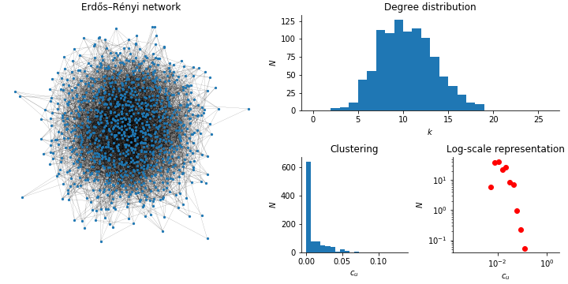

Title: Complex networks
Date: 2019-12-10 10:20
Category: Physics
Tags: Complex networks
Slug: complex-network
Author: Rémy Torro
Summary: An investigation of complex system networks using the python package <code>networkx</code>.

 

# Erds-Rényi model

An Erds-Rényi (or random) network is a network in which the probability for a link to exist is a constant $p$. 

	:::python
	N = 1000
	p = 0.01
	E = N*(N-1)/2 #number of possible links
	nE = int(p*E) #actual number of links in the network

	G = nx.Graph()
	lNodes = range(N)

	for i in range(nE):
		a,b = sample(lNodes,2)
		while G.has_edge(a,b):
			a,b = sample(lNodes,2)
		G.add_edge(a,b)

	nx.draw_spring(G,node_size=10,width=0.5)
