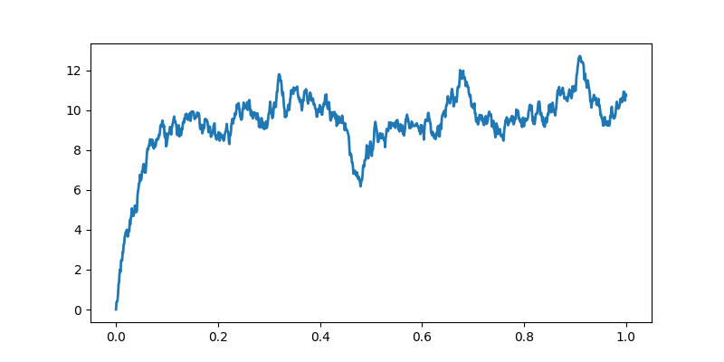
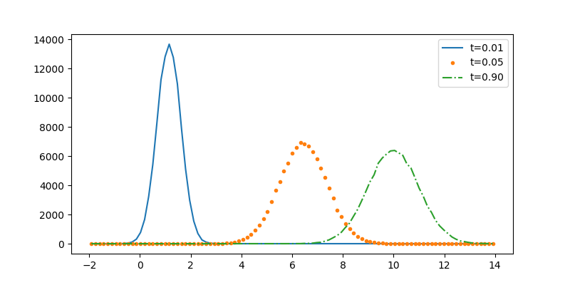

Title: Ornstein–Uhlenbeck process
Date: 2019-12-10 10:20
Category: Physics
Tags: Stochastic, Differential equations
Slug: ornstein-uhlenbeck
Author: Rémy Torro
Summary: Properties of Ornstein-Uhlenbeck processes.

> How can we define stochastic differential equations? 

We are interested in solving the following stochastic differential equation: 

$$ dx = a(x,t) dt + b(x,t) dW$$

# Ito's lemma

Firstly, we must introduce rules for changing variables in a S.D.E. Assume $y = g(x)$. In the limit $dt \rightarrow 0$, the terms $dt^2$ and $dt dW$ go to zero faster than $dW^2$, which is $O(dt)$. We can set $dt^2$ and $dtdW$ to zero and substitute $dW^2$ for $dt$:

$$dy = y(t+dt) - y(t) = g(x(t+dt))-g(t) = g(x+dx)-g(x) = g(x) + g'(x)dx + \frac{1}{2}g''(x) (dx)^2 - g(x) = g'(x)[a(x,t) dt + b(x,t) dW] + \frac{1}{2}g''(x) [a^2(x,t)(dt)^2 + b^2(x,t)(dW)^2 + 2 a(x,t) b(x,t) dt dW] = [g'(x) a(x,t) + \underbrace{\frac{1}{2}g''(x)b^2(x,t)}_{\textrm{additional term}}]dt + g'(x)b(x,t)dW
$$

These approximations constitute Ito's lemma and allow us to perform chain rules in a stochastic setting. 

# Problem

For $I(T)=\int_0^T (dW)^2$, evalluate the mean and variance:

$$\langle I(T) \rangle = \int_0^T \langle (dW)^2 \rangle = \int_0^T dt = T$$

$$V[I(T)] = \lim_{N \rightarrow \infty} V\left[\sum_{n=0}^{N-1} (\Delta W_n)^2 \right] = \lim_{N\rightarrow \infty} \sum_{n=0}^{N-1} V[(\Delta W_n)^2]$$

$$ V[(\Delta W_n)^2] = \langle (\Delta W_n)^4 \rangle - \langle (\Delta W_n)^2 \rangle^2 = \langle (\Delta W_n)^4 \rangle - (\Delta t)^2 = 2 (\Delta t)^2$$

$$ \langle (\Delta W)^4 \rangle = \int_{-\infty}^{\infty} \frac{(\Delta W)^4}{\sqrt{2 \pi \Delta t}} e^{-\frac{(\Delta W)^2}{2\Delta t}} = 3 (\Delta t)^2$$

The Ornstein–Uhlenbeck process is an exactly soluble S.D.E, the equivalent to the original [Langevin](https://remy13127.github.io/brownian-motion.html) equation. 

$$ dx = - \gamma x dt + c dW$$

This S.D.E. can be solved by variation of parameters. Let's set $y = x e^{\gamma t}$:

$$dy = (x+dx)e^{\gamma(t+dt)} - xe^{\gamma t} = (x+dx)e^{\gamma t}(1+\gamma dt) - xe^{\gamma t} = (xe^{\gamma t}+e^{\gamma t}dx)(1+\gamma dt) - xe^{\gamma t} = \gamma x e^{\gamma t} dt + e^{\gamma t} dx + \underbrace{dx dt \gamma e^{\gamma t}}_{0} = \gamma x e^{\gamma t} + [-\gamma x dt + c dW]e^{\gamma t} = c e^{\gamma t} dW $$

$$ y(t) = y(0) + c\int_0^t e^{\gamma t'} dW(t') = y(0) + \lim_{N \rightarrow \infty} \sum_{n=0}^{N-1} c e^{\gamma n \Delta t}\Delta W_n$$

$$x(t) = x(0) e^{-\gamma t} + c\int_0^t e^{\gamma(t' -t)} dW(t) $$

In the following, we will be interested in S.D.Es of the form:

$$ dx = \underbrace{- \frac{x-\mu}{\tau} dt}_{\textrm{deterministic term}} + \underbrace{\sigma \sqrt{\frac{2}{\tau}} dW}_{\textrm{stochastic term}}$$

where $x(t)$ is the stochastic process, $\mu$ the mean, $\sigma$ the standard deviation and $\tau$ the time constant. $W$ is a Wiener process. Using the Euler-Maruyama method, we can discretize time and add infinitesimal steps to the process at every time step. For the following equation:

$$ dx = a(t,x) dt + b(t,x) dW$$

We can apply the Euler-Maruyama discretization and get:

$$ x_{n+1} = x_n + dx = x_n + a(t,x_n)dt + b(t,x_n) \sqrt{dt}\xi \qquad \xi \approx \mathcal{N}(0,1)$$

	::python
	sigma = 1. #standard deviation
	mu = 10. #mean
	tau = .05 #time constant

	dt = .001 #time step
	T = 1. #total time
	n = int(T/dt) #number of time steps
	t = np.linspace(0.,T,n) #vector of times

	sigma_bis = sigma*np.sqrt(2. / tau)
	sqrtdt = np.sqrt(dt)

	x = np.zeros(n)

	#Euler-Maruyama method

	for i in range(n-1):
		x[i+1] = x[i] + dt*(-(x[i]-mu)/tau)+sigma_bis*sqrtdt*np.random.randn()

	fig, ax = plt.subplots(1,1,figsize=(8,4))
	ax.plot(t,x,lw=2)

	::python
	ntrials = 100000
	X = np.zeros(ntrials)

	# We create bins for the histograms.
	bins = np.linspace(-2., 14., 100)
	fig, ax = plt.subplots(1, 1, figsize=(8, 4))
	for i in range(n):
		# We update the process independently for
		# all trials
		X += dt * (-(X - mu) / tau) + sigma_bis * sqrtdt * np.random.randn(ntrials)
		# We display the histogram for a few points in time
		if i in (5, 50, 900):
			hist, _ = np.histogram(X, bins=bins)
			ax.plot((bins[1:] + bins[:-1]) / 2, hist, {5: '-', 50: '.', 900: '-.', }[i],label=f't={i * dt:.2f}')
		ax.legend()

The distribution of the process tends to a Gaussian distribution with mean $\mu=10$ and standard deviation $\sigma = 1$.

#Stratonovich definition

$$ x(N\Delta t) = x(0) + \sum_{n=0}^{N-1} a \left(\frac{x((n+1)\Delta t)+x(n\Delta t)}{2},n\Delta t \right)\Delta t+\sum_{n=0}^{N-1} b \left(\frac{x((n+1)\Delta t)+x(n\Delta t)}{2},n\Delta t \right)\Delta W_n$$

We have:

$$\frac{x((n+1)\Delta t)+x(n\Delta t)}{2} = \frac{2x(n\Delta t)+\Delta x_n}{2} = x(n\Delta t) + \frac{\Delta x_n}{2} $$

where $\Delta x_n = x_{n+1} - x_{n}$. 

$$ x(N\Delta t) = x(0) + \sum_{n=0}^{N-1} a \left(x(n\Delta t) + \frac{\Delta x_n}{2},n\Delta t \right)\Delta t+\sum_{n=0}^{N-1} b \left(x(n\Delta t) + \frac{\Delta x_n}{2},n\Delta t \right)\Delta W_n$$

$$a \left(x_n + \frac{\Delta x_n}{2},n\Delta t \right)\Delta t \approx a_n \Delta t + \underbrace{\frac{\partial a_n}{\partial x}\frac{\Delta x_n}{2} \Delta t}_{\Delta x \Delta t = 0}+\underbrace{\frac{1}{2}\frac{\partial^2 a_n}{\partial x^2}\left(\frac{\Delta x_n}{2}\right)^2 \Delta t}_{(\Delta x)^2 \Delta t = 0} + ... \approx a_n \Delta t$$

$$b \left(x_n + \frac{\Delta x_n}{2},n\Delta t \right)\Delta W_n \approx b_n \Delta W_n + \underbrace{\frac{\partial b_n}{\partial x}\frac{\Delta x_n}{2} \Delta W_n}_{\Delta x_n \Delta W_n = a_n \Delta t \Delta W + b_n (\Delta W_n)^2}+\underbrace{\frac{1}{2}\frac{\partial^2 b_n}{\partial x^2}\left(\frac{\Delta x_n}{2}\right)^2 \Delta t}_{(\Delta x)^2 \Delta W_n = 0} + ... \approx b_n \Delta W_n + \frac{1}{2}\frac{\partial b_n}{\partial x} b_n \Delta t$$
