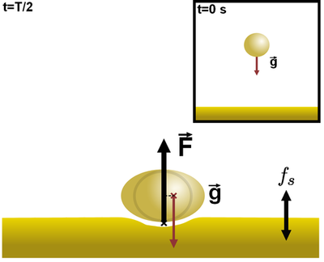
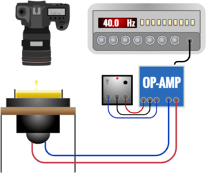
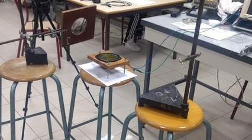
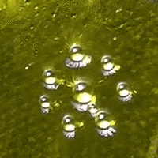
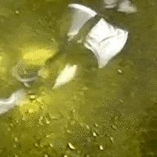

Title: Walking droplets
Date: 2019-12-15
Category: Physics
Tags: Walkers
Slug: hydrodynamics
Author: Rémy Torro
Summary: walking test.

 

Introduction
============

#### 

Jearl Walker first coined the term ‘walking droplet’ for a droplet bouncing around randomly in a vibrating fluid bath in 1978 ([@walker_amateur_1978]). In this magazine article, Walker describes James A. Raymond’s experiment in which he produced droplets of a water-detergent mixture bouncing on a vibrating bath for up to a few dozens of seconds. Silicon oil replaced the water-detergent mixture in later studies ([@protiere_particlewave_2006]) and the lifetime of the droplets was considerably extended. A study of ‘walking droplets’ in a circular corral revealed a statistical behavior similar to that of electrons in quantum corrals ([@harris_pilot-wave_2013]). The analogy with quantum mechanics was further explored in a hydrodynamic reconstruction of the double-slit experiment ([@pucci_walking_2018]), with contested results ([@klapp_recent_2016]). The topic of bouncing droplets revivified the pilot-wave theory of De Broglie ([@broglie_mecanique_1927]), in which quantum objects are localized and guided by a wave, not unlike the droplets. He quickly abandoned the theory because although it provided a deterministic description of quantum mechanics, it involved variables that cannot or have not been determined. Bouncing droplets seem to exhibit many behaviors similar to that of particles in the pilot-wave description ([@bush_pilot-wave_2015]). We reproduced Raymond’s experiment with linseed oil and characterized the bouncing droplets.

Theory
======

  

*Forces exerted on an oil droplet bouncing on a vibrating oil bath. $T$ is the time period of the droplet. $\vec{g}$ is the gravitational field. The associated force is $\vec{F_g}=m\vec{g}$, with $m$ the mass of the droplet. $\vec{F}$ is the force exerted by the compressed air layer on the droplet. This force is neglected when the droplet is far from the surface.*
#### 

Usually, when two volumes of the same fluid come into contact with each other (*e.g.* an oil droplet and a static oil bath), surface tensions try to minimize the interface between the two. The air trapped between the two volumes escapes softly and eventually the droplet coalesces with the oil bath. If the air separating the surfaces flows, a lubrication effect generates an upward lift on the droplet, maintaining the surfaces apart for a longer time. [@couder_bouncing_2005] showed that the drainage process of the air can be delayed by oscillating the bath vertically. Suppose that the vertical position of the oil bath follows: 

$$y_{s}(t)=A_{s}\cos{(2\pi f_{s} t)}$$ 

where $A_{s}$ and $f_{s}$ are respectively the amplitude and frequency of the oil bath. The acceleration can be defined as $\gamma_s=(2\pi f)^{2}A_s$. The Ohnesorge number associated with our experimental setup is smaller than one, so the deformations of the droplet cannot be neglected ([@gilet_dynamics_2008]).

$$\textrm{Oh} = \nu/\sqrt{\rho\sigma R} \\ \approx 0.0331 \times \sqrt{980\times 0.O25 \times 0.001} \\ = 0.2 $$

with respectively $\nu$, $\rho$ and $\sigma$ the viscosity, density, surface tension of the fluid and $R$ the radius of the droplet. The droplet’s bouncing can be modelled by a differential equation describing the vertical displacement of the center of mass of the droplet $y$. In the frame of the vibrating bath, the droplet feels an apparent gravity $m(\gamma_s \cos(2\pi f_s t)-g)$ ($m$ is the mass of the droplet and $g=9.81$ m.s$^{-2}$ the gravitational field). The surrounding air exerts a force $F$ on the droplet. This force can be neglected except when there is a thin layer of air between the droplet and the bath surface. One can write Newton’s second law applied to the droplet as:

$$m\frac{d^2 y}{dt^2}=m(\gamma_s \cos(2\pi f_s t)-g)+F$$

Lubrication theory must be used to estimate $F$, which is a function of the thickness of the air layer $h$ and its rate of decrease $\dot{h}$. Eventually, the vertical displacement of a droplet in time $y(t)$ can be numerically computed.

Experimental setup
==================

*Experimental setup. A circular culture dish (diameter $0.10\pm0.002$ m, height $0.0112\pm0.002$ m) filled with linseed oil (surface tension $\sigma=0.025$ N.m$^{-1}$, density $\rho=980$ kg.m$^{-3}$ and volume $\tau=1.61\times 10^{-3}\pm 4\times10^{-4}$ m$^{3}$) is glued to a speaker powered by a low frequency generator in series with an amplifier. A camera is either mounted above the dish to get a top-view or slightly above one side of the dish to get a side-view.*

The basic components of the experimental setup are described above. We decided to use edible linseed oil, which is cheaper and easier to obtain than silicon oil ([@harris_visualization_2017]). The flatness of the surface of the oil bath at rest had to be carefully adjusted prior to acquiring data. We generated droplets by dipping and immediately pulling out a needle-shaped object in the linseed oil bath. A syringe of diameter $6.382\times 10^{-4}$ m allowed us to create droplets with $D \in [4.0\times 10^{-4} \textrm{m},9.0\times10^{-4} \textrm{m}]$, where $D$ is the diameter of the droplet. A $4.3\times 10^{-3}$ m lollipop tube enabled us to produce droplets with $D \in [9.0\times 10^{-4} \textrm{m},2.5\times10^{-3} \textrm{m}]$. We did not control the diameter of a droplet. On the other hand, we could set the frequency $f_g$ and amplitude $A_g$ of the function generator.
This signal was translated by the speaker into a sinusoidal oscillation, of frequency $f_s$ and acceleration $\gamma_s$ directly applied to the liquid bath. In general $f_g \approx f_s$ whereas $A_g$ was not directly related to $\gamma_s/(2\pi f_s)^2$, because of our use of an amplifier.

#### 

The camera could film at up to 500 frames per second. In the top-view
setup, we aligned the camera vertically above the liquid bath and filmed
at 50 frames per second. This way, we could easily follow the trajectory
of a droplet on the surface of the liquid bath but we lost information
about its vertical acceleration and frequency. In the side-view setup we
could recover this information by filming at 400 frames per second. We
used a 50 cm focal length lens in order to have a good focus on the
bouncing droplets. We recorded short videos of various droplets, for
different $(f_g,A_g)$ parameters, using the diameter of the needle as a
spatial calibration. We post-treated the videos using the software
*Tracker*. For a given video of a droplet, we could generally extract
simultaneously $D$, $\gamma_s$, $f_s$, $\gamma_d$, $f_d$ where
$\gamma_d$ and $f_d$ are respectively the vertical acceleration and
frequency of a bouncing droplet.

Results
=======

    

Figure \[fig:faraday\_threshold\] shows the almost linear dependency
between the frequency $f_s$ and the acceleration $\gamma_s$ of the fluid
bath at the Faraday threshold. To get this result, we used the side-view
setup. We set $f_g$ at a chosen value and increased $\gamma_g$ until the
twisted Faraday patterns appeared. We recorded this transition at 400
frames per second and measured from the videos $f_s$ and $\gamma_s$ at
the regime transition (shown in the two pictures above and under the
linear regression curve). All of our subsequent results were obtained in
the stable regime, under the curve.\

Figure \[fig:diagram\] was made by analyzing 95 droplets and extracting
from the associated videos their radius $R_0=D/2$, $\gamma_s$ and $f_s$.
Two dimensionless parameters could be constructed from the many
variables of our experiment[@molacek_drops_2013; @molacek_drops_2013-1];
firstly a vibration number:
$$\Omega = \frac{\omega}{\omega_D}=2\pi f_s\sqrt{\frac{\rho R_0^3}{\sigma}}$$
where $\omega=2\pi f_s$ is the bath angular frequency and
$\omega_D=\sqrt{\sigma/(\rho R_0^3)}$ is a characteristic drop
oscillation frequency. And secondly a peak non-dimensional bath
acceleration: $$\Gamma = \frac{\gamma_s}{g}$$ where $g=9.81$ m.s$^{-2}$
is the gravitational acceleration.

This couple of parameters $(\Gamma,\Omega)$ was computed for each of the
droplets and plotted on a $\Gamma - \Omega$ plane. Each droplet was
qualitatively labelled as either a ‘walker’ (see figure \[fig:walker\]),
a ‘drifter’ or a fixed droplet. Intermediary behaviors exist but are
very hard to identify with unaided eyes.

#### 

A closer look at the oscillating behavior of individual droplets is
necessary to understand why they may behave differently from each other.
Similar modes of vibration are usually found between droplets belonging
to the same region of the $\Gamma - \Omega$ plane. A mode can be
characterized as a couple of values $(n,m)$ where $n$ is the number of
times a droplet bounces while the liquid bath oscillates $m$ times. The
main modes are presented in figure \[fig:bouncing\_regimes\]. In these
figures, the oscillation of the fluid bath is a curve fit of the
experimental data performed using the `SciPy` python library.

#### 

We also studied the often complex coupled behavior of droplets. One
quasi-chaotic example is presented in figure \[fig:couple\_bubbles\].

Discussion
==========

#### 

The almost linear relation between the acceleration and the frequency of
the fluid bath at the Faraday threshold was obtained in prior
experiments[@slaughter_viscosity_2014]. The characterization of the
droplets in figure \[fig:diagram\] may have been overly simplistic. It
would have been more rigorous to determine the bouncing mode of each
droplet, but this is extremely time-consuming. Our conclusion that
‘walkers’ are concentrated in one region of the $\Gamma-\Omega$ plane is
in agreement with literature[@molacek_drops_2013]. We never managed to
extend the lifetime of ‘walking droplets’ beyond a few dozen seconds.
This is mostly due to our poor frequency generator fluctuating slightly
in time. The fastest ‘walkers’ are obtained very near the Faraday
threshold. This threshold is very unstable and any fluctuation of the
frequency may disrupt the flatness of the fluid bath. On the other hand,
we managed to keep almost static (in the plane) droplets bouncing for
several minutes.

#### 

Droplets always interact with each other in some fashion. When two
‘walkers’ pass each other, different behaviors have been observed. If
the radii of the droplets are very different, a common outcome is the
absorption of the smaller droplet by the bigger one. At high velocities
and similar droplet radii, they may orbit each other, until one of them
coalesces with the fluid bath. Often, droplets tend to remain at a
stable small distance from each other. This property could be used to
create crystal-like structures of droplets (see figure \[fig:crystal\]).

Introducing a new droplet in such a complex usually resulted in a quick
and chaotic reorganization of the crystal. All of these observations
were qualitative and would need more time to be properly studied.

#### 

Most of the data was obtained by tracking droplets. It means that we
were limited by the resolution of our camera. Some droplets were only a
few pixels large and their tracking might have been approximate. In
addition, the droplets were never perfectly spherical as shown in figure
(\[fig:bubble\]). Although we could obtain precise frequency
measurements (an uncertainty $\Delta f_{s,d} =0.3$ Hz), by averaging a
large number of $y(t)$ periods, the accelerations were very sensitive to
the slightest tracking errors. Fortunately, our computations only
involved $\gamma_s$, the acceleration of the fluid bath which was easier
to track than most droplets and eventually led to a smaller error
($\Delta \gamma_s=3$ m.s$^{-2}$, which may seem a lot but is more of a
bias than an error).

Conclusion
==========

#### 

As a conclusion, this experiment enabled us to investigate the strange
behavior of ‘walking droplets’. From bouncing modes to interactions
between droplets, the observations were diverse and should provide a
first, basic introduction to the hot topic of bouncing droplets. Many
observations were not presented in this report due to a lack of time,
and are left aside for future investigations. Furthermore, material
issues prevented us from generating stable ‘walkers’ and consequently
from observing their statistical behavior. The double-slit experiment
was quickly dismissed for the same reason. A macroscopic object whose
motion is dictated by a ‘guiding’ wave is a fascinating object and other
analogies with quantum phenomena will certainly be found in the near
future.

Acknowledgements
================

We are thankful to researcher N. Papageorgiou who provided us with this
topic idea, and was our pilot-wave. We are also grateful to the rest of
the teaching staff who assisted us and provided the required gear and
equipment.

[^1]: The lubrication theory is complex and will not be discussed in
    this report.
